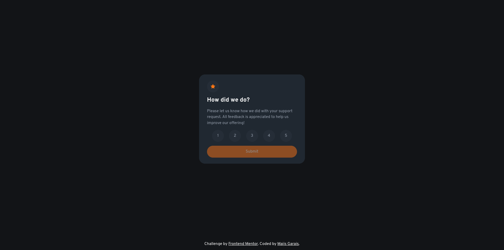

# Frontend Mentor - Interactive rating component solution

This is a solution to the [Interactive rating component challenge on Frontend Mentor](https://www.frontendmentor.io/challenges/interactive-rating-component-koxpeBUmI). Frontend Mentor challenges help you improve your coding skills by building realistic projects.

## Table of contents

- [Overview](#overview)
  - [The challenge](#the-challenge)
  - [Screenshot](#screenshot)
  - [Links](#links)
- [My process](#my-process)
  - [Built with](#built-with)
- [Author](#author)

## Overview

### The challenge

Users should be able to:

- View the optimal layout for the app depending on their device's screen size
- See hover states for all interactive elements on the page
- Select and submit a number rating
- See the "Thank you" card state after submitting a rating

### Screenshot

### Links

- Solution URL: [Frontendmentor.io](https://your-solution-url.com)
- Live Site URL: [View on Vercel](https://interactive-rating-component-mai-soup.vercel.app/)

## My process

### Built with

- Flexbox
- [React](https://reactjs.org/)
- [TailwindCSS](https://tailwindcss.com/)
- [Vite](https://vitejs.dev/)

## Author

- Website - [Maijs Garais](https://mai-soup.github.io)
- Frontend Mentor - [@mai-soup](https://www.frontendmentor.io/profile/mai-soup)
